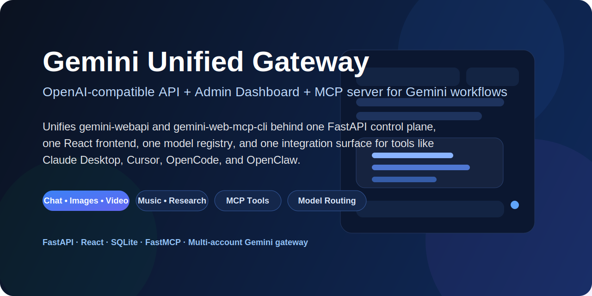
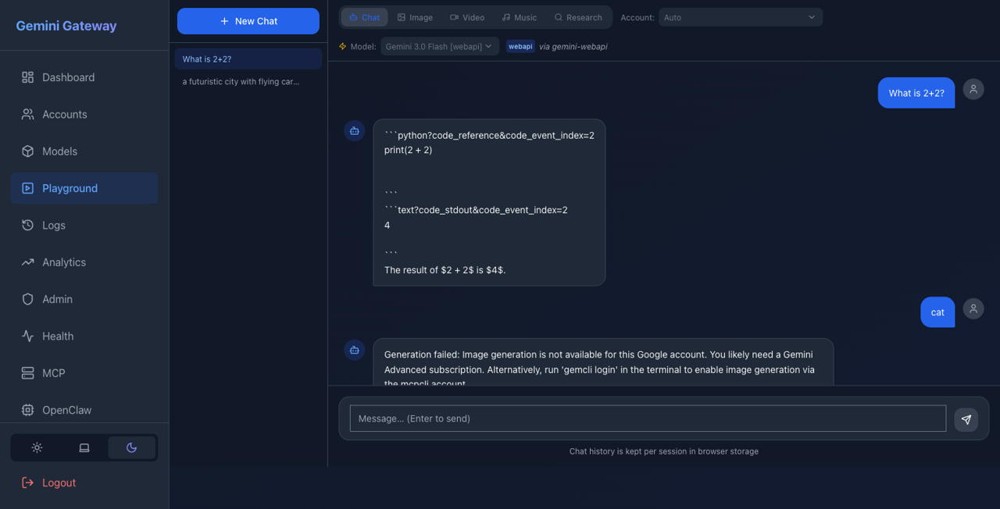
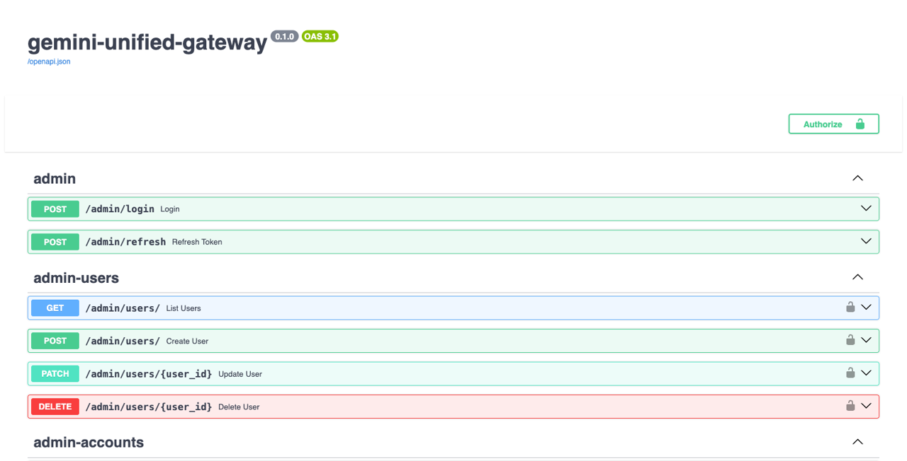
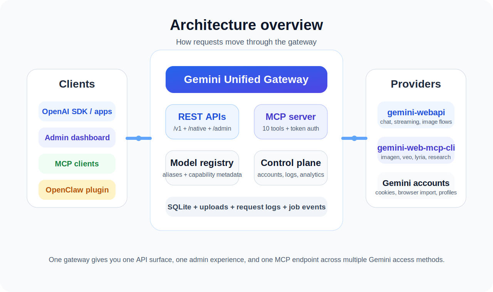
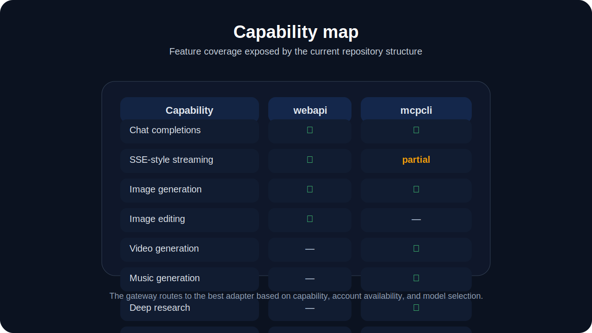

<p align="center">
  
</p>

<h1 align="center">Gemini Unified Gateway</h1>

<p align="center">
  <strong>A self-hostable Gemini gateway built with FastAPI + React + SQLite.</strong><br/>
  It unifies <code>gemini-webapi</code> and <code>gemini-web-mcp-cli</code> behind one OpenAI-compatible API,
  one admin dashboard, one model registry, and one MCP server.
</p>

<p align="center">
  
  
  
  
  
</p>

---

## Why this repository exists

Most Gemini experiments end up fragmented:

- one wrapper for chat
- another path for image or video generation
- separate logic for browser-cookie auth vs CLI-backed auth
- no single admin surface for accounts, model discovery, logs, analytics, and integrations

**Gemini Unified Gateway** solves that by acting as a single control plane and delivery layer for Gemini-powered workflows.

It gives you:

- an **OpenAI-style `/v1` API** for chat, models, responses, files, and image routes
- a **native `/native` API** for long-running media and research jobs
- a **React admin dashboard** for accounts, models, logs, analytics, health, packages, docs, and feature parity
- an **MCP server** so tools like Claude Desktop, Cursor, OpenCode, or custom MCP clients can call the same backend
- an **adapter router** that decides whether a request should go to `gemini-webapi` or `gemini-web-mcp-cli`


## At a glance

- **2 Gemini access adapters** wired into one router
- **OpenAI-compatible API** for easier app integration
- **Native task API** for image, video, music, and research jobs
- **Admin dashboard** for accounts, models, logs, analytics, health, docs, and ops
- **MCP server** for tool-oriented clients
- **SQLite-backed control plane** with uploads and job tracking
- **React playground** for manual testing across capability types

---

## Table of contents

- [What this project does](#what-this-project-does)
- [Main features](#main-features)
- [Screenshots](#screenshots)
- [Architecture](#architecture)
- [Feature coverage by adapter](#feature-coverage-by-adapter)
- [What you need before running it](#what-you-need-before-running-it)
- [Quick start](#quick-start)
- [Configuration overview](#configuration-overview)
- [Authentication model](#authentication-model)
- [API surface](#api-surface)
- [MCP and OpenClaw integration](#mcp-and-openclaw-integration)
- [Repository structure](#repository-structure)
- [Implementation notes](#implementation-notes)
- [Why this repo is useful](#why-this-repo-is-useful)

---

## What this project does

At a high level, this repository is a **Gemini gateway server and admin console**.

It sits between your clients and Gemini access layers, then handles:

### 1. Unified request routing

The backend routes requests to the most appropriate adapter:

- `gemini-webapi` for chat-heavy and web-style Gemini interactions
- `gemini-web-mcp-cli` for flows like Imagen, Veo, Lyria, and research-oriented tasks

### 2. OpenAI-compatible access

Apps that already speak the OpenAI API can point at this gateway instead of building a Gemini-specific integration from scratch.

That includes support for routes such as:

- `/v1/chat/completions`
- `/v1/models`
- `/v1/responses`
- `/v1/files`
- `/v1/images/generations`
- `/v1/images/edits`

### 3. Native Gemini-style task workflows

For long-running jobs, the repo exposes native async task endpoints such as:

- `/native/tasks/image`
- `/native/tasks/video`
- `/native/tasks/music`
- `/native/tasks/research`

Those jobs are tracked in SQLite with status, progress, result URL, and job events.

### 4. Admin and operations control plane

The React frontend provides a full operator view for:

- account onboarding and validation
- model registry refresh
- feature parity inspection
- request logs
- analytics summaries
- health and system status
- MCP token management
- package inspection
- docs browsing
- admin user management

### 5. MCP tool exposure

The repo also mounts an MCP server and exposes tools for:

- chat
- image generation
- image editing
- video generation
- music generation
- deep research
- account listing
- model listing
- capability inspection
- file listing placeholder

This makes the same backend usable from AI-native tool clients instead of only REST callers.

---

## Main features


### Core gateway features

- **Two-adapter architecture**
  - `webapi` adapter
  - `mcpcli` adapter
- **Automatic capability-based routing**
- **Multi-account management**
- **Model alias resolution**
- **Model discovery and refresh**
- **OpenAI-compatible endpoints**
- **Native async task endpoints**
- **JWT auth for admin routes**
- **API key auth for app and MCP usage**
- **Request logging and analytics**
- **SQLite-backed metadata and jobs**
- **Static upload serving**
- **Rate limiting middleware**
- **CORS-enabled backend**

### Product-facing features

- **Chat playground**
- **Image generation playground**
- **Video generation workflow**
- **Music generation workflow**
- **Research workflow**
- **Model selector**
- **Account selector**
- **Reference file upload support**
- **Job polling and status cards**
- **Real-time analytics dashboard**
- **Health dashboard**
- **Swagger docs**
- **Internal docs viewer**
- **OpenClaw plugin distribution page**
- **MCP configuration page**

### Platform and developer features

- **FastAPI backend**
- **React + Vite frontend**
- **Alembic migrations**
- **Editable local Python package**
- **Dev start / stop / restart scripts**
- **Integration and unit tests**
- **OpenClaw plugin assets bundled in the repo**
- **Uploads directory for generated media**
- **Structured request logging hooks**
- **Job event timeline support**

---

## Screenshots

<table>
  <tr>
    <td width="60%">
      
    </td>
    <td width="40%">
      
    </td>
  </tr>
  <tr>
    <td>
      <strong>Playground</strong><br/>
      Unified chat, image, video, music, and research entry point with model and account selection.
    </td>
    <td>
      <strong>Swagger / API docs</strong><br/>
      Built-in interactive API exploration for admin, native, and compatibility routes.
    </td>
  </tr>
</table>

---

## Architecture

<p align="center">
  
</p>

### Architecture summary

**Clients**
→ OpenAI SDK apps, internal tools, the web admin UI, MCP clients, and OpenClaw

**Gateway**
→ FastAPI app with auth, routing, model registry, uploads, logging, analytics, job management, and admin APIs

**Providers**
→ `gemini-webapi` and `gemini-web-mcp-cli`

**Persistence**
→ SQLite database plus filesystem-backed uploads

This structure is especially useful when you want one stable internal API even though upstream Gemini access methods have different strengths and authentication models.

---

## Feature coverage by adapter

<p align="center">
  
</p>

### Practical interpretation

| Capability | `webapi` | `mcpcli` | Notes |
|---|---:|---:|---|
| Chat completions | Yes | Yes | The router can fall back across adapters. |
| Streaming chat | Yes | Limited/simple | `webapi` is the stronger fit for streaming UX. |
| Image generation | Yes | Yes | `mcpcli` is especially useful for Imagen routes. |
| Image editing | Yes | No | Implemented through the web adapter path. |
| Video generation | No / limited by provider | Yes | Routed as async jobs. |
| Music generation | No | Yes | Routed as async jobs. |
| Deep research | No | Yes | Routed as async jobs. |
| Gems / history / extensions | Partly provider-dependent | Limited | Availability depends on upstream support. |

---

## What you need before running it

This is the most important setup section for anyone cloning the repo.

### Required

- **Python 3.11+**
- **Node.js 18+**
- **npm**
- **A writable local filesystem** for:
  - SQLite database
  - uploads
  - logs
- **At least one valid Gemini authentication path**
  - browser cookies for `gemini-webapi`
  - and/or `gemcli` / `mcpcli` auth for richer generation flows

### Usually required in practice

- **A Google account with Gemini access**
- **Chrome or Firefox on the same machine** if you want browser cookie import
- **A proper `MASTER_ENCRYPTION_KEY`**
- **A proper JWT / app secret**
- **Network access from your frontend to the backend**

### Recommended

- **A dedicated virtual environment**
- **PM2** if you want simpler frontend process management
- **Redis** only if you plan to extend the queue / ops story beyond the current default local flow
- **A Gemini-capable account with broader access** if you want video, music, and research workflows to be genuinely useful

### Auth options supported by the repo

#### Option A — browser cookies

Best when using the `webapi` adapter.

You will typically need:

- `__Secure-1PSID`
- `__Secure-1PSIDTS`

#### Option B — CLI-backed / profile-backed access

Best when using the `mcpcli` adapter for:

- image generation via Imagen
- video generation via Veo
- music generation via Lyria
- deep research flows

---

## Quick start

### 1. Clone the repository

```bash
git clone <your-repo-url>
cd gemini-unified-gateway
```

### 2. Create and activate a virtual environment

```bash
python3.11 -m venv .venv
source .venv/bin/activate
```

### 3. Install backend dependencies

```bash
cd backend
pip install -e '.[dev]'
cd ..
```

### 4. Configure environment variables

```bash
cp backend/.env.example backend/.env
```

At minimum, set these carefully in `backend/.env`:

```env
SECRET_KEY=replace-this
MASTER_ENCRYPTION_KEY=replace-this
JWT_SECRET=replace-this
DATABASE_URL=sqlite+aiosqlite:///./gemini_gateway.db
CORS_ORIGINS=["http://localhost:6401"]
```

### 5. Run database migrations

```bash
cd backend
alembic upgrade head
cd ..
```

### 6. Seed the default admin user

```bash
python backend/app/db/seed.py
```

### 7. Start the backend

```bash
uvicorn backend.app.main:app --host 0.0.0.0 --port 6400 --reload
```

### 8. Start the frontend

In another terminal:

```bash
cd frontend
npm install
npm run dev
```

### 9. Open the app

- Frontend: `http://localhost:6401`
- Swagger docs: `http://localhost:6400/docs`
- Health: `http://localhost:6400/health`

### 10. Sign in and change defaults immediately

The current codebase seeds default admin credentials. Treat them as bootstrap-only and rotate them as soon as the environment is up.

---

## Configuration overview

The repo ships with a rich `.env.example`. Important groups include:

### Ports

- API
- frontend
- MCP
- Prometheus
- Redis
- websocket

### Security

- `SECRET_KEY`
- `MASTER_ENCRYPTION_KEY`
- `JWT_SECRET`
- access token lifetimes

### Gemini auth

- `GEMINI_COOKIE_1PSID`
- `GEMINI_COOKIE_1PSIDTS`
- `GEMINI_API_KEY`

### Storage

- SQLite database paths
- uploads directory
- log file path

### Ops and product settings

- model refresh cadence
- analytics retention
- package watch interval
- rate limits
- CORS origins

---

## Authentication model

This repository uses more than one auth layer because it serves different kinds of consumers.

### Admin routes

Use **JWT bearer tokens** after logging in through:

```http
POST /admin/login
```

### OpenAI-compatible and native app routes

Use an **API key** in headers:

```http
X-API-Key: sk-...
```

### MCP routes

The MCP server accepts bearer-style auth or API-key-style auth, depending on the client setup.

### Provider credentials

Account credentials are stored for provider access, and the repo includes encryption helpers for persisted secrets. In real deployments, you should always set a production-grade `MASTER_ENCRYPTION_KEY`.

---

## API surface

### OpenAI-compatible API

The repo exposes an OpenAI-style surface for applications that already know how to speak OpenAI APIs.

Examples include:

- `POST /v1/chat/completions`
- `GET /v1/models`
- `POST /v1/responses`
- `POST /v1/files`
- `GET /v1/files`
- `POST /v1/images/generations`
- `POST /v1/images/edits`

### Native API

For Gemini-specific and long-running operations:

- `GET /native/limits`
- `POST /native/tasks/image`
- `POST /native/tasks/video`
- `POST /native/tasks/music`
- `POST /native/tasks/research`
- `GET /native/tasks/{job_id}`
- `GET /native/jobs/{job_id}`
- `GET /native/jobs/{job_id}/events`
- `GET /native/jobs/{job_id}/stream`
- `GET /native/history`
- `GET /native/gems`
- `GET /native/extensions`

### Admin API

The admin surface covers:

- auth
- users
- accounts
- account capabilities
- model registry
- logs
- analytics
- health
- API keys
- MCP tokens
- packages
- feature parity
- restart helpers

---

## MCP and OpenClaw integration

### MCP server

This repo mounts an MCP server under:

```text
/mcp
```

Current tool set includes:

- `chat`
- `generate_image`
- `edit_image`
- `generate_video`
- `generate_music`
- `deep_research`
- `list_accounts`
- `list_models`
- `get_capabilities`
- `list_files`

That makes the project useful not only as a REST gateway, but also as a tool server for agentic clients.

### OpenClaw assets

The repository also contains a bundled OpenClaw plugin package under:

```text
backend/app/static/plugins/openclaw/
```

That includes:

- plugin metadata
- packaged archives
- skills for gateway operation and troubleshooting

This is a strong differentiator if you want the same backend to support both traditional API consumers and tool-using agents.

---

## Repository structure

```text
.
├── backend/
│   ├── app/
│   │   ├── accounts/          # account loading and adapter wiring
│   │   ├── adapters/          # webapi + mcpcli adapters + router
│   │   ├── api/               # admin, native, openai, mcp
│   │   ├── analytics/         # request aggregation
│   │   ├── auth/              # JWT, API key, RBAC
│   │   ├── db/                # engine, models, seeding
│   │   ├── jobs/              # async job lifecycle
│   │   ├── models/            # model registry + aliasing
│   │   ├── storage/           # file storage helpers
│   │   └── utils/             # encryption, media, events, SSE
│   ├── alembic/               # migrations
│   └── tests/                 # unit + integration tests
├── frontend/
│   ├── src/components/        # reusable UI components
│   └── src/pages/             # dashboard, accounts, playground, docs, etc.
├── docs/                      # markdown docs rendered in the frontend
├── scripts/                   # dev and restart scripts
└── uploads/                   # generated and uploaded media
```

---

## Why this repo is useful

This repository is especially valuable if you want to:

- **plug Gemini into software that already expects the OpenAI API**
- **route different Gemini capabilities through one backend**
- **operate multiple Gemini accounts from one admin console**
- **give developers, operators, and agent clients one common integration layer**
- **test chat, image, video, music, and research flows from a single UI**
- **expose Gemini capabilities to MCP-aware tools without building a separate server**

In other words, it is not just a wrapper. It is a **Gemini integration platform**.

---

## Implementation notes

A few details are worth knowing before production use:

- Some capabilities are **provider-dependent**, so exact behavior can vary with upstream account access and the installed upstream library versions.
- The repo already includes **strong structure for logs, analytics, jobs, model discovery, and account management**, but you should still harden secrets, defaults, and deployment topology before exposing it publicly.
- Browser import works best when the server runs on the same machine as the browser profile.
- The current codebase contains a broad surface area, so the best production path is to start with:
  - admin login
  - account import / validation
  - `/v1/chat/completions`
  - `/native/tasks/*`
  - `/mcp`
  and then tighten settings from there.

### Snapshot observations from this repository

- The frontend includes a **Forgot Password** page, but the matching reset route is not present in the current backend snapshot.
- A `docker-compose.yml` file exists, but it references Dockerfiles that are not included in this snapshot.
- Several “rich” Gemini features depend on **real provider access**, so full behavior still depends on account health, cookies, profile auth, and upstream library capability.

These are normal for an active integration repo, but they are worth cleaning up before a public launch.

---

## Tech stack

### Backend

- FastAPI
- SQLAlchemy
- Alembic
- SQLite
- Pydantic
- Uvicorn / Gunicorn
- FastMCP

### Frontend

- React
- TypeScript
- Vite
- Tailwind CSS
- React Query
- Zustand
- Recharts / ECharts

### Upstream Gemini access

- `gemini-webapi`
- `gemini-web-mcp-cli`

---

## Best-fit use cases

- Internal AI platform for a team
- Gemini compatibility layer for OpenAI-first apps
- Local or self-hosted AI media generation console
- MCP tool backend for Claude Desktop, Cursor, OpenCode, or custom agents
- Research and experimentation environment for Gemini account routing

---

## Final summary

If you want a repository that combines:

- **Gemini account management**
- **OpenAI-compatible APIs**
- **native task workflows**
- **React admin operations**
- **MCP tool serving**
- **multi-adapter routing**
- **file uploads and generated media storage**

then this repo is already organized around exactly that problem.

It is a strong base for turning Gemini access into a cleaner, more operable, more reusable internal platform.
